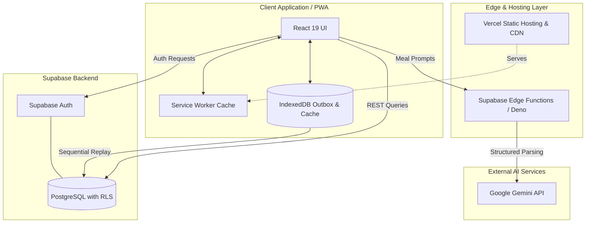

# Yourbody.fyi

An open-source, mobile-first, offline-ready fitness and nutrition tracking progressive web app with intelligent ghost sets, AI meal parsing, and coach/athlete collaboration.

Live application: [https://www.yourbody.fyi](https://www.yourbody.fyi)

---

## Features

- **Workout Logging with Ghost Sets**: Real-time workout tracking featuring benchmark ghost set suggestions (`computeGhostSets`) based on chronological set history and calculated 1RM benchmarks.
- **Nutrition with AI Meal Parsing via Gemini**: Multimodal and natural language dietary logging powered by serverless Gemini edge functions (`supabase/functions/parse-nutrition`), with local fallback parsing for structured nutrition blocks.
- **Offline-First PWA**: Deterministic offline outbox with sequential replay under Web Locks, client-generated UUIDs, optimistic UI overlays, and per-user IndexedDB storage.
- **Coach / Athlete Linking via Codes**: Multi-coach and athlete collaboration with unique coach codes (`users.coach_code`), athlete roster management, and isolated access controls.
- **Comprehensive Data Export**: Complete user data portability supporting JSON and CSV export across workouts, sets, nutrition logs, custom dishes, routines, and profile metrics (`src/components/settings/DataExportCard.tsx`).

---

## Tech Stack

| Layer | Technologies | Purpose |
|---|---|---|
| **Frontend & UI** | React 19, TypeScript, Vite 8, Tailwind CSS v4, Lucide React | Mobile-first responsive interface with dynamic code splitting |
| **State & Offline Storage** | TanStack Query v5, TanStack Query Persist Client, `idb`, `workbox-window` | Server-state caching, persistent IndexedDB stores, outbox queue |
| **Mobile & Native** | Capacitor 7, Capacitor Health Connect Plugin | Native Android wrapper and Health Connect synchronization |
| **Backend & Database** | Supabase (PostgreSQL 17), PostgREST, Gotrue Auth | Relational database, role-based authentication, and Row Level Security |
| **Serverless & AI** | Deno 2, Google Gemini API (Google GenAI SDK) | Edge functions for conversational meal parsing and athlete provisioning |
| **Hosting & CDN** | Vercel | Static asset delivery, edge routing, and strict security headers |
| **Testing & Quality** | Vitest, Playwright, pgTAP, Oxlint | End-to-end, visual density, database integrity, and static analysis |

---

## Architecture

The application is structured around a client-first progressive web app backed by Supabase PostgreSQL with Row Level Security and Deno serverless edge functions:



---

## Offline-First Architecture

Yourbody is designed to provide seamless offline workout and nutrition tracking:

- **Per-User IndexedDB Partitioning**: Isolated `yourbody-offline-<userId>` databases store serialized query caches (`rq`), offline mutations (`outbox`), ID mappings (`idmap`), and queued AI requests (`aiq`).
- **Deterministic Outbox & Replay**: All mutations use client-generated UUIDs with monotonic sequencing. Replays execute idempotent upserts (`ON CONFLICT DO NOTHING`) to ensure zero duplicated records.
- **Concurrency & Ownership Guards**: Web Locks (`navigator.locks`) coordinate multi-tab access, while strict session-owner checks verify active credentials before flushing outbox queues.
- **PWA Update Safety Protocol**: Service worker updates evaluate hard blockers (syncs in-flight, modal dialogs) and soft blockers (active workouts, dirty forms) before prompting reloads.

For a comprehensive technical write-up, see [`docs/offline.md`](docs/offline.md).

---

## Security Model

- **Row Level Security (RLS) on Every Table**: All database tables enforce RLS policies, ensuring athletes access only their own records while coaches access authorized athlete data.
- **`SECURITY DEFINER` Functions with Pinned `search_path`**: Helper functions (e.g. `public.is_coach()`, `public.is_athlete_of()`, `public.handle_new_user()`) execute with `SET search_path = public, pg_temp` to prevent recursive policy triggers and search-path spoofing.
- **Protected Billing & Role Columns**: Database triggers (`protect_user_role_change`, `protect_user_subscription_fields`) restrict mutations on sensitive columns (`users.role`, `coach_tier`, `max_athletes`) exclusively to administrative service roles.
- **Strict HTTP Headers**: Production deployments enforce Content-Security-Policy (CSP) with strict connect boundaries, HTTP Strict Transport Security (`max-age=31536000; includeSubDomains; preload`), `X-Frame-Options: DENY`, and `X-Content-Type-Options: nosniff`.

---

## Performance

The project maintains strict performance baselines and query optimization standards:

- **Mobile Production Baseline**: Documented in [`docs/perf-baseline.md`](docs/perf-baseline.md). Measures throttled mobile performance (Slow 4G network and 4x CPU slowdown), tracking initial route JavaScript gzip (216.13 KB vs. 250 KB ceiling), entry chunks (40.27 KB), and PostgREST payload sizes (e.g., 68.32 KB for `/workout` first paint).
- **Query Execution & Index Coverage**: Documented in [`docs/query-plans.md`](docs/query-plans.md). Analyzes `EXPLAIN (ANALYZE, BUFFERS)` execution plans on PostgreSQL across 11,000 sets and 5,500 nutrition logs, verifying composite B-tree index coverage (`idx_workouts_user_date`, `idx_sets_workout_created`, `idx_nutrition_user_logged`) to guarantee zero unindexed sequential scans on transactional tables, along with analytical server RPCs (`get_history_sessions`, `get_exercise_stats`, `get_ghost_sets`).

---

## Testing & CI

Continuous integration executes a multi-layer verification suite:

- **Vitest Unit & Component Tests**: `npm test` runs component, hook, and algorithm suites. Multi-timezone invariant tests run via `npm run test:tz`.
- **Playwright End-to-End**: Multi-viewport test runs covering Desktop Chrome, Mobile Safari, and Narrow Safari (320px) viewports (`npm run test:e2e`), visual density validations (`npm run test:density`), and production PWA service worker tests (`npm run test:pwa`).
- **Database Tests (pgTAP)**: `npm run test:db` verifies schema constraints, cascade behaviors, and RLS policies against local Supabase containers.
- **Edge Function Tests (Deno)**: `npm run test:deno` verifies Edge Functions, model fallback chains, and payload normalization.
- **Performance & Quality Budgets**: Automated CI checks enforce query bounds and bundle size thresholds (`npm run perf:budget`), mock fidelity (`npm run check:mocks`), payload projections (`npm run check:payload`), and design tokens (`npm run check:design`, `npm run check:brand`).

---

## Local Development Quickstart

### Prerequisites

- **Node.js**: v22+
- **Deno**: v2+
- **Docker**: For running local Supabase emulator
- **Supabase CLI**: For database migrations and pgTAP tests

### Setup Instructions

1. **Install dependencies**:
   ```bash
   npm ci
   ```

2. **Start the local Supabase emulator**:
   ```bash
   npx supabase start
   ```

3. **Configure environment variables**:
   ```bash
   cp .env.example .env
   ```

4. **Start the Vite development server**:
   ```bash
   npm run dev
   ```

5. **Run test suite**:
   ```bash
   npm test
   ```

---

## Project Structure

```
├── android/                 # Capacitor Android native project & manifest
├── docs/                    # Technical documentation and performance baselines
├── public/                  # Static assets, web manifest, and icons
├── scripts/                 # Performance verification, seeding, and migration scripts
├── src/                     # React application source code
│   ├── components/          # Domain components (auth, workout, nutrition, history, coach, settings)
│   ├── context/             # React state contexts (AuthContext, CoachContext)
│   ├── hooks/               # Application hooks
│   ├── lib/                 # Core libraries (Supabase client, nutrition parsing, sets)
│   ├── offline/             # Offline outbox, flusher, replay, DB, and compaction
│   ├── offline-prefetch/    # Background caching for offline readiness
│   ├── pwa/                 # Service worker lifecycle and update safety guards
│   ├── types/               # TypeScript type definitions and database schemas
│   └── utils/               # Workout math, date helpers, data export utilities
├── supabase/                # PostgreSQL migrations, pgTAP tests, and Deno Edge Functions
└── tests/                   # Playwright E2E and visual density test specifications
```

---

## Support & Inquiries

For questions or security disclosures, contact support@yourbody.fyi.

---

## License

AGPL-3.0 © 2026 Yourbody.fyi contributors
