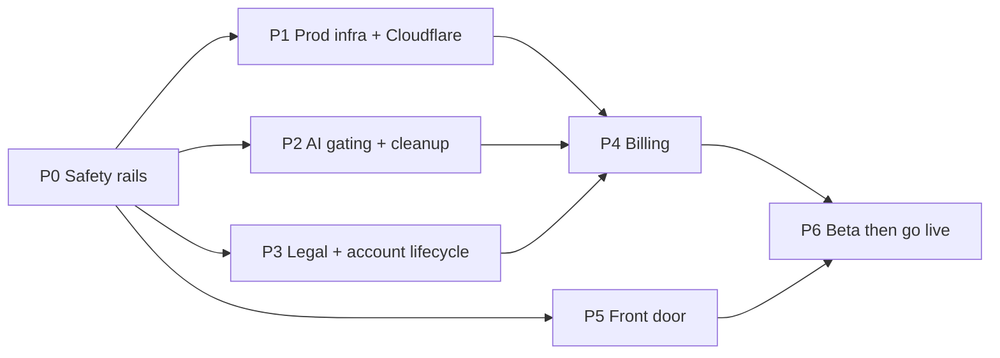

# Yourbody.fyi launch plan: commercial web MVP

> **Status:** Living document  
> **Last updated:** 2026-10-06  
> **Baseline:** Live at www.yourbody.fyi.  
> **Goal:** A real, working commercial app (sign up → pay → use → cancel, refund, delete), legally covered and backed up, at ≈ $0 fixed cost until revenue. Not a goal: scale.

---

## 🛡️ Rule zero: production works at ALL times

The live application at www.yourbody.fyi remains functional and reliable throughout. All work happens on branches, gets checked on a preview build backed by a **staging** database, and reaches production only when verified. Every pull request follows these rules:

| # | Rule |
|---|---|
| **R1** | `main` = production. Changes land **only via PR with green CI**. No direct pushes; enforced by a branch ruleset on `main`. |
| **R2** | Every PR gets a **preview deployment wired to the STAGING Supabase project**. Never point previews or tests at production. |
| **R3** | **Backward-compatible DB changes only (expand → migrate → contract).** Each migration must work with the currently deployed frontend *and* older installed PWA clients and their offline queues, which can be days old. Never drop or rename something in the same release that stops using it. |
| **R4** | **Deploy order:** backup (`pg_dump`) → additive migrations → edge functions (backward-compatible) → frontend. Automated in CD; never by hand from a laptop. |
| **R5** | **New user-visible features ship dark** behind a flag (server-side `app_config` row or `VITE_FEATURE_*`). Turn them on only after verifying in prod with a dedicated test account. Billing, paywall, quota and landing page all launch this way. |
| **R6** | **Post-deploy smoke test** runs automatically: site loads, test-account login, log a set, AI parse. Failure → rollback. |
| **R7** | **Rollback is always one step:** hosting "instant rollback" to the previous deployment; edge functions redeploy the previous release tag; DB via down-migration (`supabase/rollback/` pattern) or restore from the pre-deploy dump. |
| **R8** | **Real user accounts are never test subjects.** Destructive flows (account deletion, billing, refunds) are tested on staging or a dedicated prod test account. |
| **R9** | **Infrastructure moves are reversible:** the old host stays live until the new one is verified; DNS cutover uses a low TTL and can be flipped back. |
| **R10** | Small PRs, one concern each; tag every production release (`vYYYY.MM.DD-n`). The existing PWA update gate already keeps updates from interrupting an active workout. Keep it. |

---

## Decisions (final)

| # | Resolution |
|---|---|
| D1 | **Freemium:** free logging + local parser; AI meal parsing limited for free users. |
| D2 | **Pro $10/yr, auto-renew.** No lifetime tier. |
| D3 | **20 AI parses/month free**; Pro gets a generous fair-use cap (~30/day; photo = 2). **One paid Gemini key** + budget alert. |
| D4 | **Stripe**; a Radar rule blocks EU/UK card countries (no-threshold VAT). EU/UK users keep the free tier. |
| D5 | **Remove** coach "create athlete" (UI, `localStorage` fake fallback in `src/context/CoachContext.tsx:130-146`, `create-athlete` function). Coaches use `YB-` codes. |
| D6 | **Move hosting to Cloudflare Pages** (free, commercial use allowed) before the first live charge; Vercel stays live until cutover is verified (R9). |
| D7 | **AI is online-only for everyone.** Offline, the AI input is disabled with a hint ("AI needs a connection: use quick log"); the local parser and manual logging keep working. Queued AI items already in users' IndexedDB still replay for one release (R3), then the queued-AI code is removed in a later "contract" PR. No grace-period logic needed. |
| D8 | **Hard delete** + offer export + wipe local IndexedDB. |
| D9 | **Adapt Basecamp's open-source policies (CC BY 4.0)** + health disclaimer + refund policy. |
| D10 | **Google sign-in: yes** (free). |
| D11 | **PostHog Cloud free**, cookieless; events `signup`, `first_workout`, `first_ai_parse`, `paywall_shown`, `upgraded`. |
| D-O2-2 | Approved 2026-10-05: the header pending-sync count shows outbox items only. |
| D12 | Public repository published with a fresh single-commit history; earlier private history is not published. |

---

## Phases

Size: S ≈ half a day · M ≈ 1–2 days · L ≈ 3–5 days. 👤 = maintainer-only step.

### P0: Safety rails (do first; makes rule zero real)
| # | Task | Suggested solution | Size |
|---|---|---|---|
| 0-1 | 👤 Staging DB | Create a 2nd free Supabase project `yourbody-staging`. Configure repository secrets `SUPABASE_ACCESS_TOKEN_STAGING`, `STAGING_DB_PASSWORD`, and `STAGING_PROJECT_REF`. Configure `*_PROD` equivalents only in a GitHub Environment `production` with a required reviewer; backups run from a separate private operations repository (so production DB credentials never live in the public repo). | S |
| 0-2 | Plan in repo | This document, including the D-O2-2 approval. | S |
| 0-3 | **Clean public repo** | Done 2026-10-05: Published clean public repository snapshot with sanitized history and AGPL-3.0 license. | M |
| 0-4 | Branch protection | On the public repo: require PR + passing CI checks, linear history, no force-push, auto-delete merged branches. | S |
| 0-5 | CD pipeline | GitHub Action on merge to `main`: `pg_dump` (prod) → `supabase db push` → `functions deploy` → (frontend deploys via host) → smoke test (R6) → create release tag. PR workflow: migrations + functions to **staging**. | M |
| 0-6 | Nightly backup + keep-alive | Scheduled Action in private operations repository: encrypted (`age`) `pg_dump` of prod, 14-day retention as private artifacts/storage; plus a daily one-row DB query so the free project never pauses. One **restore drill** into staging. | S |
| 0-7 | Feature flags | `app_config` table (read-only to clients, service-role writes) + `useFeatureFlag()` hook. Used by every later phase (R5). | S |

**Exit:** a PR shows a preview running on staging; merging deploys automatically with backup + smoke test; rollback tested once.

### P1: Production infra + Cloudflare migration
| Task | Suggested solution | Size |
|---|---|---|
| Custom SMTP | 👤 Resend account; SPF/DKIM in Cloudflare DNS; branded confirm/reset templates; turn on email confirmations in prod. Site URL / redirects = `https://www.yourbody.fyi`. | S |
| Error tracking | `@sentry/react` + top-level `ErrorBoundary`; Sentry in edge functions; source maps from CI; add Sentry ingest to CSP. | M |
| Uptime | Uptime monitor on `www.yourbody.fyi` + smoke endpoint. | S |
| Paid Gemini key | 👤 Billing-enabled key as Supabase secret + budget alert. | S |
| **Cloudflare Pages (D6)** | ① Pages project from the **public repo** (`npm run build` → `dist`, same `VITE_*` vars; previews → staging). ② Port `vercel.json` → `public/_headers` + `public/_redirects`, keeping the `sw.js`/workbox/manifest exclusions and no-cache headers. ③ Add the `*.pages.dev` pattern to `supabase/functions/_shared/cors.ts` + Supabase redirect URLs. ④ Run e2e + `check-csp` against the `pages.dev` URL. ⑤ 👤 Flip the `www` record to Pages (low TTL), apex → www redirect rule. ⑥ Keep Vercel live 7 days, then disconnect. Same origin, so installed PWAs + offline data carry over. | M |

### P2: AI gating + cleanup
| Task | Suggested solution | Size |
|---|---|---|
| AI quota | `ai_usage(user_id, period_start, count)` + `SECURITY DEFINER` RPC `consume_ai_quota(cost)`: atomic, limit by plan (free 20/mo; Pro ~30/day; photo = 2). Called in `supabase/functions/parse-nutrition` before Gemini; structured 429 `{code:'quota_exceeded'}` → upgrade sheet. Ships dark (R5). | M |
| **AI online-only (D7)** | Disable the AI input when the connectivity store says offline, with a hint; local parser stays. Keep replay of already-queued AI items for one release; later "contract" PR removes queued-AI code + tests. | M |
| Image + retry caps | Reject `image_base64` > ~1.5 MB; cap the model fallback chain to 2. | S |
| Remove coach provisioning (D5) | Remove the UI, the fake fallback in `src/context/CoachContext.tsx:130-146`, and the `supabase/functions/create-athlete` function (+ its tests). | S |
| CSP pin | `connect-src` → exact Supabase project origins (prod + staging) instead of `*.supabase.co`. | S |
| Doc hygiene | Review technical documentation in `docs/` (`docs/architecture.md`, `docs/deployment.md`, etc.) to ensure docs reflect current architecture and clean public state. | S |

### P3: Legal + account lifecycle
| Task | Suggested solution | Size |
|---|---|---|
| Policies | Public routes `/terms`, `/privacy`, `/refunds` from adapted Basecamp policies; processors listed (Supabase, Gemini, Stripe, Sentry, PostHog, Cloudflare); health disclaimer; offline local storage explained. | S |
| Consent | Checkbox on Register (+ Google sign-in notice); store `terms_version`, `terms_accepted_at` (protected columns). | S |
| Delete account | Settings → confirm (offers export) → `delete-account` function: cancel Stripe subscription → `auth.admin.deleteUser`. Verify `ON DELETE CASCADE` everywhere (watch foreign key `ON DELETE RESTRICT` on `template_exercises.exercise_id`). Client wipes `yourbody-offline-${userId}` + caches, then signs out. Residue test. Tested on staging only (R8). | M |

### P4: Billing (Stripe, test mode first)
| Task | Suggested solution | Size |
|---|---|---|
| Schema | `users`: `plan`, `paid_until`, `billing_customer_id`; `billing_events(event_id pk)`; extend `protect_user_subscription_fields`. | S |
| Entitlement | `has_pro(uid)` = `paid_until > now()`; used by `consume_ai_quota`; `useEntitlement()` hook (persisted for offline display). | S |
| Checkout + portal | `create-checkout` / `create-portal-session` functions (JWT; `client_reference_id = auth.uid()`; yearly price). | M |
| Webhook | `stripe-webhook` (`verify_jwt=false`): signature check, idempotency, `checkout.session.completed`, `invoice.paid`, `customer.subscription.deleted`, `charge.refunded`. | M |
| Paywall UI | Upgrade sheet on `quota_exceeded`; Pro badge + "Manage billing". Behind flag (R5). | M |
| Radar + tests | 👤 Radar rule: block EU/UK card countries. Webhook unit tests; Stripe test-mode e2e via `stripe listen` against staging. | M |
| Grandfather | Existing users → Pro for 1 year. | S |

### P5: Front door
Landing page at `/` for signed-out visitors (hero, AI demo, offline badge, pricing, FAQ, legal links; lazy chunk) · iOS "Add to Home Screen" hint + `beforeinstallprompt` on Android · Google sign-in · 3-step onboarding (goal → targets → first log) · OG tags, `robots.txt`, `sitemap.xml` · PostHog events. All behind flags until P6.

### P6: Beta, then go live
1. Turn flags on for maintainer + beta cohort (100% coupon). Watch Sentry, the funnel and AI cost per user for 2 weeks.
2. **Go-live checklist:** Cloudflare serving prod ✔ · Stripe live mode + Radar rule ✔ · legal pages live ✔ · backups + restore drill ✔ · support inbox (`support@yourbody.fyi` via Cloudflare Email Routing) ✔.
3. Public launch: Product Hunt, fitness subreddits, build-in-public posts (link the public repo), coaches.

**Order:** P0 → (P1 ∥ P2 ∥ P3 ∥ P5) → P4 → P6. Roughly 4 weeks.
