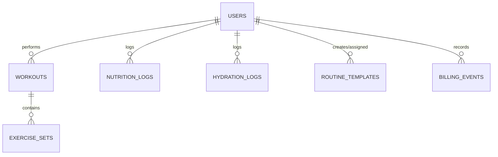

# Backend Documentation

## Database Schema (ERD)



## Design Decisions

### RLS Recursion Fixes
- **The Problem**: Checking `role = 'coach'` using an inline subquery against `public.users` within policies creates an infinite loop.
- **The Solution**: Encapsulated role checks in a `SECURITY DEFINER` function (`public.is_coach()`). This guarantees the function executes with bypass permissions to inspect `public.users` safely, avoiding the recursive trigger on the table's own policies.

### Constraints & Integrity
- Strict Foreign Keys between users, workouts, sets, and templates.
- Enforced cascade delete logic to prevent orphaned rows across the system.

## Serverless Edge AI (Deno/Gemini)

### Nutrition Parsing (`parse-nutrition`)
- **Fallback Chain**: Uses a resilient model fallback sequence: `gemini-3.6-flash` → `gemini-3.5-flash` → `gemini-3.1-flash-lite`.
- Parses conversational diet logs and extracts multi-dish macros securely.

### API Contracts
Edge functions run purely externally. Explicitly define request and response payload shapes:
- **`parse-nutrition` Request**: `{ text: string }`
- **`parse-nutrition` Response**: `{ dishes: Array<{ name, energy, protein, ... }> }`

## AI Quota

### Overview
AI quota tracking enforces rate and usage limits on generative parse requests (e.g. `parse-nutrition`) based on user plan tiers while allowing dark-launch rollout and fail-open resilience.

### Database Schema

#### `public.ai_usage`
Tracks consumed AI parse credits aggregated by period:
- `user_id` (`uuid`, references `public.users(id)` ON DELETE CASCADE): User identifier.
- `period_kind` (`text`, CHECK `period_kind IN ('day', 'month')`): Quota period granularity.
- `period_start` (`date`): Normalized start date of the period in UTC.
- `count` (`integer`, CHECK `count >= 0`): Number of quota units consumed in the period.
- `updated_at` (`timestamptz`): Last consumption timestamp.
- Primary key: `(user_id, period_kind, period_start)`.

Row Level Security (RLS) is enabled. Authenticated users can SELECT their own rows (`user_id = auth.uid()`). Direct INSERT, UPDATE, and DELETE operations are restricted to `service_role`; writes occur through the atomic RPC function.

#### User Billing Protection
- `public.users.trial_ends_at`: Nullable timestamp for custom trial expiration overrides.
- Trigger `trg_protect_user_billing_fields` executes `public.protect_user_billing_fields()` BEFORE UPDATE on `public.users` to prevent client modification of `trial_ends_at` unless authenticated as `service_role`.

### RPC Interface

#### `public.consume_ai_quota(p_cost integer DEFAULT 1) RETURNS jsonb`
Atomically checks and consumes quota credits for the authenticated user (`auth.uid()`).
- Validates `p_cost BETWEEN 1 AND 10`.
- Resolves the user's plan via `public.ai_plan_for(user_id)` ('trial' or 'free').
- Reads period and limit configurations from `app_config.ai_quota_limits`.
- Performs an atomic `INSERT ... ON CONFLICT DO UPDATE ... WHERE count + EXCLUDED.count <= limit RETURNING count`.
- Returns a JSON object:
  ```json
  {
    "allowed": true,
    "plan": "trial",
    "limit": 30,
    "used": 1,
    "cost": 1,
    "period": "day",
    "resets_at": "2026-10-11T00:00:00+00:00"
  }
  ```
- When denied (`allowed: false`), `used` reflects the current count without mutating state.

#### `public.ai_plan_for(p_user_id uuid) RETURNS text`
Evaluates whether a user is eligible for trial parsing (`now() < COALESCE(trial_ends_at, created_at + trial_days)`), returning `'trial'` or `'free'`.

### Configuration Keys (`public.app_config`)
- `ai_quota_enabled`: Boolean flag controlling whether edge functions enforce quota consumption before calling Gemini. Defaults to `false` (shipped dark).
- `ai_quota_limits`: JSON configuration defining per-plan quota limits, reset periods, photo cost multipliers, and default trial duration:
  ```json
  {
    "photo_cost": 2,
    "plans": {
      "trial": { "period": "day", "limit": 30 },
      "basic": { "period": "month", "limit": 100 },
      "pro": { "period": "day", "limit": 30 },
      "free": { "period": "month", "limit": 0 }
    },
    "trial_days": 14
  }
  ```

### Enabling Quota Enforcement
To activate quota enforcement in production or staging, update the `ai_quota_enabled` row to `true` using a `service_role` client:
```sql
UPDATE public.app_config
SET value = 'true'::jsonb, updated_at = now()
WHERE key = 'ai_quota_enabled';
```
If the key does not exist:
```sql
INSERT INTO public.app_config (key, value, description)
VALUES ('ai_quota_enabled', 'true'::jsonb, 'Enforce AI parse quotas in parse-nutrition')
ON CONFLICT (key) DO UPDATE SET value = EXCLUDED.value, updated_at = now();
```

## Terms & Consent

### Consent Protection & Audit (`accept_terms`)
- **Direct Column Writes Protected**: `terms_version` and `terms_accepted_at` on `public.users` cannot be modified directly via standard client UPDATE queries. Direct writes are guarded by trigger `trg_protect_user_consent_fields`, which permits updates only via the `accept_terms` RPC (using local config flag `app.consent_write`), migrations/direct admin sessions (empty JWT claims), or the administrative `service_role`.
- **Atomic Consent RPC**: `public.accept_terms(p_version text)` validates version format (`YYYY-MM-DD`), verifies authentication (`auth.uid()`), stamps `terms_accepted_at = now()` atomically in `public.users`, and returns the recorded terms version and timestamp payload.

## Billing and Entitlement

### Overview
The billing and entitlement subsystem tracks subscription plans (`free`, `basic`, `pro`), paid subscription periods (`paid_until`), payment provider customer identifiers (`billing_customer_id`), and incoming provider webhook events. Administrative service-role webhooks are the sole authority permitted to modify user billing fields, while client applications read entitlement status through secure RPC helpers.

### Database Schema

#### `public.users` (Billing Columns)
- `plan` (`text`, CHECK `plan IS NULL OR plan IN ('free', 'basic', 'pro')`): Active subscription tier.
- `paid_until` (`timestamptz`): Expiration timestamp for the current paid subscription period.
- `billing_customer_id` (`text`): External payment provider customer identifier. Guarded by a partial unique index (`WHERE billing_customer_id IS NOT NULL`) ensuring a 1:1 mapping between users and payment accounts.

#### User Billing Protection
The `trg_protect_user_billing_fields` trigger runs `public.protect_user_billing_fields()` `BEFORE UPDATE` on `public.users`. Any attempt by `anon` or `authenticated` roles to alter `plan`, `paid_until`, `billing_customer_id`, or `trial_ends_at` raises an authorization exception. Only `service_role` (e.g. payment webhook handlers) can update these fields. Standard user-editable columns (e.g. target macros, timezone) remain updatable by authenticated users.

#### `public.billing_events`
An immutable log of payment provider webhook events ensuring idempotent processing:
- `event_id` (`text PRIMARY KEY`): Unique provider event identifier.
- `type` (`text NOT NULL`): Webhook event type (e.g. `invoice.paid`, `customer.subscription.deleted`).
- `user_id` (`uuid REFERENCES public.users(id) ON DELETE SET NULL`): Associated user, if resolved.
- `customer_id` (`text NULL`): External payment provider customer identifier.
- `payload` (`jsonb NOT NULL DEFAULT '{}'::jsonb`): Full event payload.
- `received_at` (`timestamptz NOT NULL DEFAULT now()`): Receipt timestamp.
- `processed_at` (`timestamptz NULL`): Worker processing timestamp.

Row Level Security is enabled on `billing_events` with all access revoked from `anon` and `authenticated`. Only `service_role` has access to this table.

### Entitlement Helpers

#### `public.has_pro(p_user_id uuid) RETURNS boolean`
STABLE, SECURITY DEFINER helper returning `true` when a user has `plan = 'pro'` and `paid_until > now()`. Callers other than `service_role` may only query their own user ID (`auth.uid()`); querying other users returns `false`.

#### `public.has_paid_plan(p_user_id uuid) RETURNS text`
STABLE, SECURITY DEFINER internal helper returning the user's plan (`'basic'` or `'pro'`) if active (`paid_until > now()`), otherwise `NULL`. Revoked from public, anon, and authenticated.

#### `public.ai_plan_for(p_user_id uuid) RETURNS text`
Evaluates active paid plans first (via `public.has_paid_plan`), then trial eligibility, falling back to `'free'`.

#### `public.get_my_entitlement() RETURNS jsonb`
STABLE, SECURITY DEFINER RPC callable by authenticated users (`auth.uid()`). Returns an object summarizing current user entitlement:
```json
{
  "plan_effective": "pro",
  "plan": "pro",
  "paid_until": "2026-11-10T00:00:00+00:00",
  "trial_ends_at_effective": "2026-10-24T00:00:00+00:00",
  "has_pro": true
}
```
Unauthenticated calls raise an authentication required error (`28000`).

### Grandfather Pro Grant

To support early adopters during the introduction of subscription plans, migration `20261010050000_grandfather_existing_users.sql` executes a one-time grant of one year of Pro access to all existing users (`plan = 'pro'`, `paid_until = greatest(coalesce(paid_until, now()), now() + interval '1 year')`). Prior plan status and expiration dates are preserved in the `public.billing_grandfather` audit table (`user_id`, `prev_plan`, `prev_paid_until`, `granted_until`, `granted_at`), which is protected by RLS with all access revoked from `anon` and `authenticated` roles and configured with `ON DELETE CASCADE` to support user deletion. The grant logic is encapsulated in `public.grandfather_existing_users()`, an idempotent `SECURITY DEFINER` function callable only by administrative database roles. Rollback via `supabase/rollback/20261010050000_down.sql` reverts `plan` and `paid_until` for users whose grant remains untouched (`plan = 'pro' AND paid_until = granted_until`) before removing the function and audit table.

## Stripe (test mode, staging)

### Overview
Stripe integration provides serverless edge functions for checkout session generation, customer portal navigation, and subscription webhook processing. This implementation operates in test mode on staging environments. Live keys are strictly refused by design. No user interface components are included in this PR.

### Edge Functions
All edge functions are configured in `supabase/config.toml` and execute in the Supabase Deno Edge Runtime:

1. **`create-checkout`** (`verify_jwt = true`):
   - **Method**: `POST`
   - **Auth**: Requires valid Supabase user JWT via `Authorization: Bearer <token>`. Caller authenticated via `userClient.auth.getUser()`.
   - **Request**: `{ "plan": "basic" | "pro" }`
   - **Origin Validation**: Evaluates the `Origin` header against the shared CORS allowlist. Returns `400` on missing or disallowed origins.
   - **Checkout Session**: Creates a Stripe Checkout session in `mode: 'subscription'`, setting `client_reference_id = user.id`, `metadata.user_id = user.id`, and `subscription_data.metadata.user_id = user.id`. Reuses existing `users.billing_customer_id` if present; otherwise specifies `customer_email`. Sets `success_url` to `${origin}/settings?billing=success` and `cancel_url` to `${origin}/settings?billing=cancelled`.
   - **Response**: `{ "url": string }`

2. **`create-portal-session`** (`verify_jwt = true`):
   - **Method**: `POST`
   - **Auth**: Requires valid Supabase user JWT via `Authorization: Bearer <token>`.
   - **Origin Validation**: Resolves `return_url` as `${origin}/settings` only if the `Origin` header passes the shared CORS allowlist (returns `400` otherwise).
   - **Customer Requirement**: Inspects `users.billing_customer_id` via `service_role`. Returns `409` (`{ "code": "no_billing_customer" }`) if no customer record exists.
   - **Response**: `{ "url": string }`

3. **`stripe-webhook`** (`verify_jwt = false`):
   - **Method**: `POST`
   - **Signature Verification**: Verifies incoming `Stripe-Signature` header against the raw body using `stripe.webhooks.constructEventAsync()` with `STRIPE_WEBHOOK_SECRET` and `Stripe.createSubtleCryptoProvider()`. Returns `400` (`{ "error": "Invalid signature" }`) on verification failure without leaking details.
   - **Endpoint Path**: `/functions/v1/stripe-webhook`

### Secrets and Environment Configuration
The following environment secrets must be configured in Supabase (values reside on staging only; production retains none):
- `STRIPE_SECRET_KEY`: Stripe API secret key (test mode only, starting with `sk_test_`).
- `STRIPE_WEBHOOK_SECRET`: Webhook signing secret (`whsec_...`).
- `STRIPE_PRICE_BASIC`: Stripe Price identifier for the basic subscription plan.
- `STRIPE_PRICE_PRO`: Stripe Price identifier for the pro subscription plan.
- Standard platform variables: `SUPABASE_URL`, `SUPABASE_ANON_KEY`, `SUPABASE_SERVICE_ROLE_KEY`.

### Live Key Refusal
The shared guard `_shared/stripeConfig.ts` inspects `STRIPE_SECRET_KEY` on invocation. If the key starts with `sk_live_` or `rk_live_`, execution terminates immediately returning `503` (`{ "code": "live_keys_refused" }`). If `STRIPE_SECRET_KEY` is unset or empty, the guard returns `503` (`{ "code": "billing_not_configured" }`). Secret keys are never logged.

### Stripe Dashboard Webhook Configuration
The webhook listener at `/functions/v1/stripe-webhook` handles the following events, which must be enabled in the Stripe dashboard:
- `checkout.session.completed`: Sets `users.billing_customer_id` for the corresponding `client_reference_id`.
- `invoice.paid`: Resolves the user by `billing_customer_id` (fallback to subscription `metadata.user_id`), maps the price ID to `plan` (`basic` or `pro`) using fallback resolution (`line.pricing.price_details.price`, `line.price.id`, or subscription item price lookup), and updates `paid_until` to the period end timestamp (`line.period.end` or `period_end`). If the plan cannot be resolved, leaves user records unchanged to avoid granting time without an active tier. Before writing entitlement grants, inspects the invoice payment (via `invoice.payments`, `charge`, or `payment_intent`) and skips the grant if the payment is disputed (`charge.disputed === true`) or fully refunded (`amount_refunded === amount` without `keep_access`), recording the processed event in `billing_events` without re-granting access. If the user has an active grant in `public.billing_grandfather` (`granted_until > now()`), preserves the higher tier (`pro` > `basic`) and extends `paid_until = greatest(current paid_until, period end)`.
- `customer.subscription.deleted`: Leaves `paid_until` as-is, granting the user access through the end of the prepaid period with no plan modification.
- `charge.refunded`: Revokes access on full refunds (`amount_refunded === amount`) unless `keep_access` metadata is present; immediately cancels the related Stripe subscription without proration (`prorate=false`, `invoice_now=false`). Partial refunds leave access and subscription unchanged.
- `charge.dispute.created`: Resolves the customer via the dispute's charge, revokes access, immediately cancels the related Stripe subscription without proration, and records the event in `billing_events` with the resolved `user_id`. The staging webhook endpoint must subscribe to `charge.dispute.created`.
- Unhandled/unknown event types: Recorded in `billing_events`, marked as processed, and acknowledged with `200` (`{ "ignored": true }`). Note that `charge.dispute.closed` is not subscribed.

### Refunds, Disputes, Auto-Cancellation and Won Disputes
- **Full refund**: A full refund (`amount_refunded === amount` where `amount > 0`) revokes access by updating `paid_until = least(paid_until, now())` for the customer and immediately cancels the related Stripe subscription (`DELETE /v1/subscriptions/{id}` with `prorate=false` and `invoice_now=false`). Subscription resolution inspects charge -> payment intent -> invoice -> `parent.subscription_details.subscription`, falling back to the customer's active/trialing/past_due/unpaid subscriptions. If no subscription exists (e.g. one-off payment), cancellation is safely skipped.
- **Partial refund**: A partial refund does not change user access (`paid_until` and `plan` remain untouched) and does not cancel the subscription; the event is recorded in `billing_events`.
- **Disputes**: A dispute (`charge.dispute.created`) resolves the customer via the dispute's charge (fetching `GET /v1/charges/<id>` if the dispute lacks the customer), revokes access (`paid_until = least(paid_until, now())`), and immediately cancels the related Stripe subscription without proration. Disputes have no `keep_access` override. The staging webhook endpoint must subscribe to `charge.dispute.created`.
- **Goodwill refund (override)**: To issue a refund without revoking user access or cancelling the subscription, set metadata `keep_access = true` through either:
  - **Stripe Dashboard**: Add metadata key `keep_access` with value `true` on the payment (PaymentIntent) page before issuing the refund.
  - **Stripe CLI**: `stripe refunds create --charge <ch_id> -d "metadata[keep_access]=true"`
  Goodwill full refunds never cancel the subscription.
- **Won dispute (manual restoration step)**: `charge.dispute.closed` is **not subscribed** by the webhook endpoint; access is NOT restored automatically upon winning a dispute. Because the Stripe subscription was already cancelled when the dispute was created, the customer must re-subscribe through the app/checkout to resume recurring billing. To manually restore the user's access for their remaining paid period in the interim, the owner executes a service-role SQL update against `public.users`:
  ```sql
  -- Restore plan and paid_until for a won dispute user
  UPDATE public.users
  SET plan = 'pro', -- or 'basic'
      paid_until = now() + interval '30 days' -- or specific period
  WHERE id = '<user_uuid>';
  ```
- **Grandfather-aware entitlement grants (`invoice.paid`)**: When processing `invoice.paid`, the webhook checks `public.billing_grandfather` for the target user. If an active grant exists (`granted_until > now()`), the update retains the higher plan tier (`pro` > `basic`) and updates `paid_until = greatest(current paid_until, period_end)`. Users whose grant has expired (`granted_until <= now()`) or non-grandfathered users follow the standard plan and paid_until overwrite.
- **Restricted API Key Permissions**: In addition to read permissions on Charges, Invoices, PaymentIntents, and Customers, the Stripe restricted key requires `Subscriptions: write` (specifically `DELETE /v1/subscriptions/{id}`) to enable automated subscription cancellation upon full refunds and disputes.

### Idempotency and State Mutations
Incoming webhook events are recorded in `public.billing_events`:
```sql
INSERT INTO public.billing_events (event_id, type, customer_id, user_id, payload)
VALUES (...)
ON CONFLICT (event_id) DO NOTHING;
```
If an event was already processed (row exists), the endpoint immediately returns `200` (`{ "duplicate": true }`) without triggering duplicate state side effects.

Payloads stored in `billing_events` are strictly minimal, capturing only technical identifiers, object types, status flags, transaction amounts, and period expiration timestamps. No customer names, email addresses, payment methods, or physical addresses are stored. All database updates to `public.users` execute through the `service_role` client to satisfy the `protect_user_billing_fields()` trigger.

## Account Deletion

### Overview & Feature Flag
Account deletion is governed by a server-side feature flag stored in `public.app_config`:
- **Key**: `account_deletion_enabled`
- **Default Value**: `false` (boolean JSON)
- **Client Access**: Guarded via `useFeatureFlag('account_deletion_enabled')`. When false or unconfigured, the 'Delete account' danger-zone card is completely hidden.
- **Server Guard**: Even if called directly, the `delete-account` edge function queries `public.app_config` with the caller's JWT client and returns `403 { code: 'feature_disabled' }` unless `value === true`.

### Edge Function (`delete-account`)
Configured in `supabase/config.toml` under `[functions.delete-account]` with `verify_jwt = true`.

- **HTTP Method**: POST only (OPTIONS returns 200 with shared CORS headers; other methods return 405).
- **Authentication**: Requires valid Bearer JWT. Validates caller via `userClient.auth.getUser()`, returning 401 on failure.
- **Payload Contract**:
  - Request Body: `{"confirm": "DELETE"}` (returns `400 { code: 'confirmation_required' }` if missing or mismatch).
  - Success Response: `200 { "deleted": true }`.
  - Error Response: `500 { "error": "Account deletion failed", "code": "delete_failed" }` without leaking internal errors, identifiers, or credentials.
  - Privacy & Logging: User IDs, emails, and sensitive keys are never logged.

### Order of Operations
1. **Client Preparation**:
   - Checks `useFeatureFlag('account_deletion_enabled')` (hidden if disabled) and `useOnlineStatus()` (disabled when offline).
   - Allows user to export all personal data first via `executeDataExport` (`src/utils/dataExport.ts`).
   - Requires explicit textual confirmation: typing `DELETE` unlocks the deletion action.
   - Invokes `supabase.functions.invoke('delete-account', { body: { confirm: 'DELETE' } })`.

2. **Server-Side Execution**:
   - Validates CORS origin, HTTP POST method, and Authorization header.
   - Checks `app_config.account_deletion_enabled === true` using caller client.
   - Initializes service-role client (`SUPABASE_SERVICE_ROLE_KEY`).
   - **Stripe Cancellation**: If `STRIPE_SECRET_KEY` is present and user profile contains a `billing_customer_id`, active/trialing/past-due subscriptions are cancelled via Stripe REST API (`DELETE /v1/subscriptions/{id}`). Keys starting with `sk_live_` or `rk_live_` are refused.
   - **RESTRICT Cleanup**: Cleans up child entities that could violate `ON DELETE RESTRICT` constraints during cascade:
     - Deletes caller's `template_exercises` and `routine_templates`.
     - Deletes caller's `sets` and `workouts`.
     - For caller's custom `exercises`: clone-and-repoint. For each other user U whose `sets` or `template_exercises` reference caller's custom exercise E, creates a cloned copy of E owned by U (`user_id = U`, `is_master = false`), repoints U's referencing rows to the clone, and deletes E. This completely purges User A's custom exercises without leaking to other users or corrupting User B's templates and workout history.
   - **User Deletion**: Calls `auth.admin.deleteUser(user.id)`, triggering PostgreSQL foreign key cascades.

3. **Client Completion**:
   - On 200 response, invokes `wipeUserData(userId, { queryClient })`:
     - Closes and deletes the user's IndexedDB database (`yourbody-offline-${userId}`).
     - Clears the in-memory React Query cache.
     - Removes `yourbody_*` localStorage keys scoped to this user and session.
   - Calls `auth.signOut()`.
   - Navigates to `/login` with a neutral confirmation notification.

### Data Retention & Cascades
- **Deleted**:
  - `auth.users` row and `public.users` row (`20260831150310_init_schema.sql`).
  - `public.workouts` and `public.sets` (`20260831150310_init_schema.sql`).
  - `public.routine_templates` and `public.template_exercises` owned by the user (`20260901000000_v2_expansion.sql`).
  - `public.nutrition_logs` (`20260831150310_init_schema.sql`) and `public.custom_dishes` (`20260903000000_production_hardening.sql`).
  - `public.coach_athlete_links` where user is coach or athlete (`20260909000000_multi_coach_code_linking.sql`).
  - `public.exercise_hides` hidden by the user (`20260927030000_exercise_catalog.sql`).
  - `public.ai_usage` quota records (`20261010010000_ai_quota.sql`).
  - Local client storage: IndexedDB `yourbody-offline-${userId}`, React Query cache, and user-scoped `yourbody_*` localStorage keys.
- **Preserved**:
  - Other users' data is untouched.
  - `public.billing_events`: `user_id` is set to `NULL` via `ON DELETE SET NULL` (`20261010030000_billing_entitlement.sql`), retaining immutable payment records for accounting and audit compliance.
  - Routine templates created by coaches for this athlete have `assigned_to` set to `NULL` (`ON DELETE SET NULL`, `20260901000000_v2_expansion.sql`).
  - Custom exercises referenced by other users are cloned and repointed to the referencing users (`user_id = U`), preserving their templates and history under personal ownership without leaking to global catalog (`20260927000000_exercises_rls_v2.sql`).

### Staging-Only Testing Note
Account deletion permanently and irreversibly destroys user records and offline data. The `account_deletion_enabled` flag must remain `false` in production environments until formally verified in staging with synthetic test accounts.
