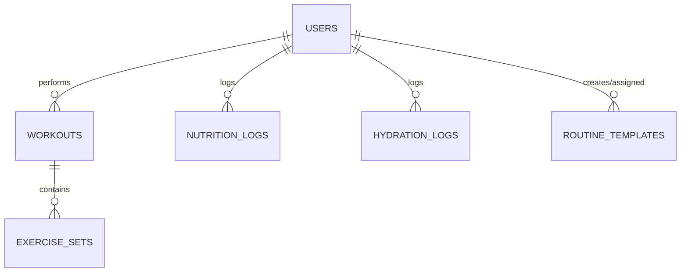

# Backend Documentation

## Database Schema (ERD)



## Design Decisions

### RLS Recursion Fixes
- **The Problem**: Checking `role = 'coach'` using an inline subquery against `public.users` within policies creates an infinite loop.
- **The Solution**: Encapsulated role checks in a `SECURITY DEFINER` function (`public.is_coach()`). This guarantees the function executes with bypass permissions to inspect `public.users` safely, avoiding the recursive trigger on the table's own policies.

### Constraints & Integrity
- Strict Foreign Keys between users, workouts, sets, and templates.
- Enforced cascade delete logic to prevent orphaned rows across the system.

## Serverless Edge AI (Deno/Gemini)

### Nutrition Parsing (`parse-nutrition`)
- **Fallback Chain**: Uses a resilient model fallback sequence: `gemini-3.6-flash` → `gemini-3.5-flash` → `gemini-3.1-flash-lite`.
- Parses conversational diet logs and extracts multi-dish macros securely.

### API Contracts
Edge functions run purely externally. Explicitly define request and response payload shapes:
- **`parse-nutrition` Request**: `{ text: string }`
- **`parse-nutrition` Response**: `{ dishes: Array<{ name, energy, protein, ... }> }`
## AI Quota

### Overview
AI quota tracking enforces rate and usage limits on generative parse requests (e.g. `parse-nutrition`) based on user plan tiers while allowing dark-launch rollout and fail-open resilience.

### Database Schema

#### `public.ai_usage`
Tracks consumed AI parse credits aggregated by period:
- `user_id` (`uuid`, references `public.users(id)` ON DELETE CASCADE): User identifier.
- `period_kind` (`text`, CHECK `period_kind IN ('day', 'month')`): Quota period granularity.
- `period_start` (`date`): Normalized start date of the period in UTC.
- `count` (`integer`, CHECK `count >= 0`): Number of quota units consumed in the period.
- `updated_at` (`timestamptz`): Last consumption timestamp.
- Primary key: `(user_id, period_kind, period_start)`.

Row Level Security (RLS) is enabled. Authenticated users can SELECT their own rows (`user_id = auth.uid()`). Direct INSERT, UPDATE, and DELETE operations are restricted to `service_role`; writes occur through the atomic RPC function.

#### User Billing Protection
- `public.users.trial_ends_at`: Nullable timestamp for custom trial expiration overrides.
- Trigger `trg_protect_user_billing_fields` executes `public.protect_user_billing_fields()` BEFORE UPDATE on `public.users` to prevent client modification of `trial_ends_at` unless authenticated as `service_role`.

### RPC Interface

#### `public.consume_ai_quota(p_cost integer DEFAULT 1) RETURNS jsonb`
Atomically checks and consumes quota credits for the authenticated user (`auth.uid()`).
- Validates `p_cost BETWEEN 1 AND 10`.
- Resolves the user's plan via `public.ai_plan_for(user_id)` ('trial' or 'free').
- Reads period and limit configurations from `app_config.ai_quota_limits`.
- Performs an atomic `INSERT ... ON CONFLICT DO UPDATE ... WHERE count + EXCLUDED.count <= limit RETURNING count`.
- Returns a JSON object:
  ```json
  {
    "allowed": true,
    "plan": "trial",
    "limit": 30,
    "used": 1,
    "cost": 1,
    "period": "day",
    "resets_at": "2026-10-11T00:00:00+00:00"
  }
  ```
- When denied (`allowed: false`), `used` reflects the current count without mutating state.

#### `public.ai_plan_for(p_user_id uuid) RETURNS text`
Evaluates whether a user is eligible for trial parsing (`now() < COALESCE(trial_ends_at, created_at + trial_days)`), returning `'trial'` or `'free'`.

### Configuration Keys (`public.app_config`)
- `ai_quota_enabled`: Boolean flag controlling whether edge functions enforce quota consumption before calling Gemini. Defaults to `false` (shipped dark).
- `ai_quota_limits`: JSON configuration defining per-plan quota limits, reset periods, photo cost multipliers, and default trial duration:
  ```json
  {
    "photo_cost": 2,
    "plans": {
      "trial": { "period": "day", "limit": 30 },
      "basic": { "period": "month", "limit": 100 },
      "pro": { "period": "day", "limit": 30 },
      "free": { "period": "month", "limit": 0 }
    },
    "trial_days": 14
  }
  ```

### Enabling Quota Enforcement
To activate quota enforcement in production or staging, update the `ai_quota_enabled` row to `true` using a `service_role` client:
```sql
UPDATE public.app_config
SET value = 'true'::jsonb, updated_at = now()
WHERE key = 'ai_quota_enabled';
```
If the key does not exist:
```sql
INSERT INTO public.app_config (key, value, description)
VALUES ('ai_quota_enabled', 'true'::jsonb, 'Enforce AI parse quotas in parse-nutrition')
ON CONFLICT (key) DO UPDATE SET value = EXCLUDED.value, updated_at = now();
```
