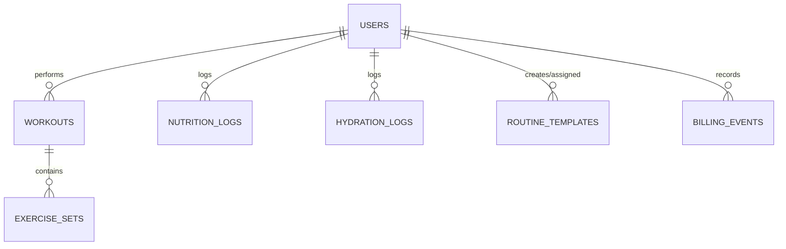

# Backend Documentation

## Database Schema (ERD)



## Design Decisions

### RLS Recursion Fixes
- **The Problem**: Checking `role = 'coach'` using an inline subquery against `public.users` within policies creates an infinite loop.
- **The Solution**: Encapsulated role checks in a `SECURITY DEFINER` function (`public.is_coach()`). This guarantees the function executes with bypass permissions to inspect `public.users` safely, avoiding the recursive trigger on the table's own policies.

### Constraints & Integrity
- Strict Foreign Keys between users, workouts, sets, and templates.
- Enforced cascade delete logic to prevent orphaned rows across the system.

## Serverless Edge AI (Deno/Gemini)

### Nutrition Parsing (`parse-nutrition`)
- **Fallback Chain**: Uses a resilient model fallback sequence: `gemini-3.6-flash` → `gemini-3.5-flash` → `gemini-3.1-flash-lite`.
- Parses conversational diet logs and extracts multi-dish macros securely.

### API Contracts
Edge functions run purely externally. Explicitly define request and response payload shapes:
- **`parse-nutrition` Request**: `{ text: string }`
- **`parse-nutrition` Response**: `{ dishes: Array<{ name, energy, protein, ... }> }`
## AI Quota

### Overview
AI quota tracking enforces rate and usage limits on generative parse requests (e.g. `parse-nutrition`) based on user plan tiers while allowing dark-launch rollout and fail-open resilience.

### Database Schema

#### `public.ai_usage`
Tracks consumed AI parse credits aggregated by period:
- `user_id` (`uuid`, references `public.users(id)` ON DELETE CASCADE): User identifier.
- `period_kind` (`text`, CHECK `period_kind IN ('day', 'month')`): Quota period granularity.
- `period_start` (`date`): Normalized start date of the period in UTC.
- `count` (`integer`, CHECK `count >= 0`): Number of quota units consumed in the period.
- `updated_at` (`timestamptz`): Last consumption timestamp.
- Primary key: `(user_id, period_kind, period_start)`.

Row Level Security (RLS) is enabled. Authenticated users can SELECT their own rows (`user_id = auth.uid()`). Direct INSERT, UPDATE, and DELETE operations are restricted to `service_role`; writes occur through the atomic RPC function.

#### User Billing Protection
- `public.users.trial_ends_at`: Nullable timestamp for custom trial expiration overrides.
- Trigger `trg_protect_user_billing_fields` executes `public.protect_user_billing_fields()` BEFORE UPDATE on `public.users` to prevent client modification of `trial_ends_at` unless authenticated as `service_role`.

### RPC Interface

#### `public.consume_ai_quota(p_cost integer DEFAULT 1) RETURNS jsonb`
Atomically checks and consumes quota credits for the authenticated user (`auth.uid()`).
- Validates `p_cost BETWEEN 1 AND 10`.
- Resolves the user's plan via `public.ai_plan_for(user_id)` ('trial' or 'free').
- Reads period and limit configurations from `app_config.ai_quota_limits`.
- Performs an atomic `INSERT ... ON CONFLICT DO UPDATE ... WHERE count + EXCLUDED.count <= limit RETURNING count`.
- Returns a JSON object:
  ```json
  {
    "allowed": true,
    "plan": "trial",
    "limit": 30,
    "used": 1,
    "cost": 1,
    "period": "day",
    "resets_at": "2026-10-11T00:00:00+00:00"
  }
  ```
- When denied (`allowed: false`), `used` reflects the current count without mutating state.

#### `public.ai_plan_for(p_user_id uuid) RETURNS text`
Evaluates whether a user is eligible for trial parsing (`now() < COALESCE(trial_ends_at, created_at + trial_days)`), returning `'trial'` or `'free'`.

### Configuration Keys (`public.app_config`)
- `ai_quota_enabled`: Boolean flag controlling whether edge functions enforce quota consumption before calling Gemini. Defaults to `false` (shipped dark).
- `ai_quota_limits`: JSON configuration defining per-plan quota limits, reset periods, photo cost multipliers, and default trial duration:
  ```json
  {
    "photo_cost": 2,
    "plans": {
      "trial": { "period": "day", "limit": 30 },
      "basic": { "period": "month", "limit": 100 },
      "pro": { "period": "day", "limit": 30 },
      "free": { "period": "month", "limit": 0 }
    },
    "trial_days": 14
  }
  ```

### Enabling Quota Enforcement
To activate quota enforcement in production or staging, update the `ai_quota_enabled` row to `true` using a `service_role` client:
```sql
UPDATE public.app_config
SET value = 'true'::jsonb, updated_at = now()
WHERE key = 'ai_quota_enabled';
```
If the key does not exist:
```sql
INSERT INTO public.app_config (key, value, description)
VALUES ('ai_quota_enabled', 'true'::jsonb, 'Enforce AI parse quotas in parse-nutrition')
ON CONFLICT (key) DO UPDATE SET value = EXCLUDED.value, updated_at = now();
```

## Terms & Consent

### Consent Protection & Audit (`accept_terms`)
- **Direct Column Writes Protected**: `terms_version` and `terms_accepted_at` on `public.users` cannot be modified directly via standard client UPDATE queries. Direct writes are guarded by trigger `trg_protect_user_consent_fields`, which permits updates only via the `accept_terms` RPC (using local config flag `app.consent_write`), migrations/direct admin sessions (empty JWT claims), or the administrative `service_role`.
- **Atomic Consent RPC**: `public.accept_terms(p_version text)` validates version format (`YYYY-MM-DD`), verifies authentication (`auth.uid()`), stamps `terms_accepted_at = now()` atomically in `public.users`, and returns the recorded terms version and timestamp payload.

## Billing and Entitlement

### Overview
The billing and entitlement subsystem tracks subscription plans (`free`, `basic`, `pro`), paid subscription periods (`paid_until`), payment provider customer identifiers (`billing_customer_id`), and incoming provider webhook events. Administrative service-role webhooks are the sole authority permitted to modify user billing fields, while client applications read entitlement status through secure RPC helpers.

### Database Schema

#### `public.users` (Billing Columns)
- `plan` (`text`, CHECK `plan IS NULL OR plan IN ('free', 'basic', 'pro')`): Active subscription tier.
- `paid_until` (`timestamptz`): Expiration timestamp for the current paid subscription period.
- `billing_customer_id` (`text`): External payment provider customer identifier. Guarded by a partial unique index (`WHERE billing_customer_id IS NOT NULL`) ensuring a 1:1 mapping between users and payment accounts.

#### User Billing Protection
The `trg_protect_user_billing_fields` trigger runs `public.protect_user_billing_fields()` `BEFORE UPDATE` on `public.users`. Any attempt by `anon` or `authenticated` roles to alter `plan`, `paid_until`, `billing_customer_id`, or `trial_ends_at` raises an authorization exception. Only `service_role` (e.g. payment webhook handlers) can update these fields. Standard user-editable columns (e.g. target macros, timezone) remain updatable by authenticated users.

#### `public.billing_events`
An immutable log of payment provider webhook events ensuring idempotent processing:
- `event_id` (`text PRIMARY KEY`): Unique provider event identifier.
- `type` (`text NOT NULL`): Webhook event type (e.g. `invoice.paid`, `customer.subscription.deleted`).
- `user_id` (`uuid REFERENCES public.users(id) ON DELETE SET NULL`): Associated user, if resolved.
- `customer_id` (`text NULL`): External payment provider customer identifier.
- `payload` (`jsonb NOT NULL DEFAULT '{}'::jsonb`): Full event payload.
- `received_at` (`timestamptz NOT NULL DEFAULT now()`): Receipt timestamp.
- `processed_at` (`timestamptz NULL`): Worker processing timestamp.

Row Level Security is enabled on `billing_events` with all access revoked from `anon` and `authenticated`. Only `service_role` has access to this table.

### Entitlement Helpers

#### `public.has_pro(p_user_id uuid) RETURNS boolean`
STABLE, SECURITY DEFINER helper returning `true` when a user has `plan = 'pro'` and `paid_until > now()`. Callers other than `service_role` may only query their own user ID (`auth.uid()`); querying other users returns `false`.

#### `public.has_paid_plan(p_user_id uuid) RETURNS text`
STABLE, SECURITY DEFINER internal helper returning the user's plan (`'basic'` or `'pro'`) if active (`paid_until > now()`), otherwise `NULL`. Revoked from public, anon, and authenticated.

#### `public.ai_plan_for(p_user_id uuid) RETURNS text`
Evaluates active paid plans first (via `public.has_paid_plan`), then trial eligibility, falling back to `'free'`.

#### `public.get_my_entitlement() RETURNS jsonb`
STABLE, SECURITY DEFINER RPC callable by authenticated users (`auth.uid()`). Returns an object summarizing current user entitlement:
```json
{
  "plan_effective": "pro",
  "plan": "pro",
  "paid_until": "2026-11-10T00:00:00+00:00",
  "trial_ends_at_effective": "2026-10-24T00:00:00+00:00",
  "has_pro": true
}
```
Unauthenticated calls raise an authentication required error (`28000`).

### Grandfather Pro Grant

To support early adopters during the introduction of subscription plans, migration `20261010050000_grandfather_existing_users.sql` executes a one-time grant of one year of Pro access to all existing users (`plan = 'pro'`, `paid_until = greatest(coalesce(paid_until, now()), now() + interval '1 year')`). Prior plan status and expiration dates are preserved in the `public.billing_grandfather` audit table (`user_id`, `prev_plan`, `prev_paid_until`, `granted_until`, `granted_at`), which is protected by RLS with all access revoked from `anon` and `authenticated` roles and configured with `ON DELETE CASCADE` to support user deletion. The grant logic is encapsulated in `public.grandfather_existing_users()`, an idempotent `SECURITY DEFINER` function callable only by administrative database roles. Rollback via `supabase/rollback/20261010050000_down.sql` reverts `plan` and `paid_until` for users whose grant remains untouched (`plan = 'pro' AND paid_until = granted_until`) before removing the function and audit table.

